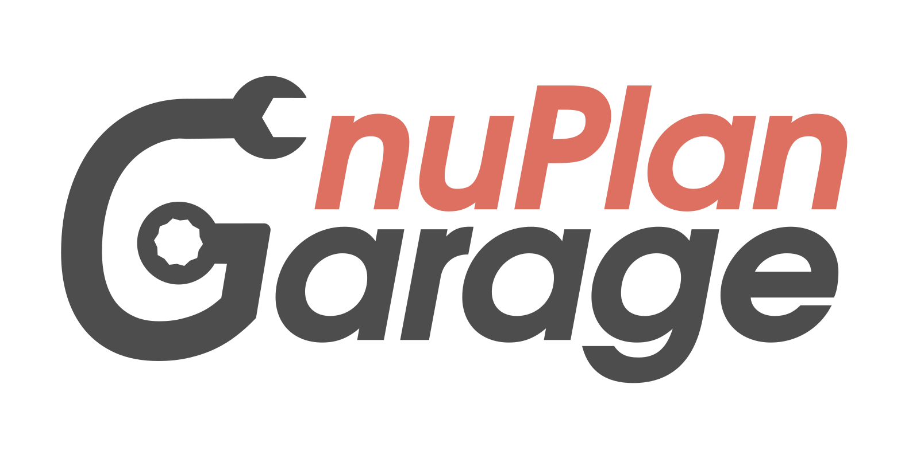

<p align="center">
    
    <h1 align="center">A Framework for Vehicle Motion Planning</h1>
    <h3 align="center"><a href="https://arxiv.org/pdf/2306.07962.pdf">PDF</a> | <a href="https://danieldauner.github.io/assets/pdf/suppmat/suppmat_dauner2023parting.pdf">Supplementary</a> | <a href="https://youtu.be/ZwhXilQKULY?t=1975">Talk</a> | <a href="https://danieldauner.github.io/assets/pdf/slides/slides_dauner2023parting.pdf">Slides</a> | <a href="https://youtu.be/oIOYQAR5P4w">Video</a> </h3>
</p>

<br/>

> This repo is intended to serve as a starting point for vehicle motion planning research on [nuPlan](https://github.com/motional/nuplan-devkit). We will provide a publicly accesible configuration for validation, comprehensive set of baselines, and pre-trained planning models.

<br/>

https://github.com/autonomousvision/nuplan_garage/assets/22528226/f91e9ce2-ae3d-4f1e-933e-d48ee5762497

## News
* **`26 Jun, 2023`:** We released our [supplementary material](https://danieldauner.github.io/assets/pdf/suppmat/suppmat_dauner2023parting.pdf) and the code for PDM-Closed. Code and models for the ML planners are coming soon, please stay tuned!
* **`14 Jun, 2023`:** We released our paper on [arXiv](https://arxiv.org/abs/2306.07962). 
* **`2 Jun, 2023`:** Our approach won the [2023 nuPlan Challenge](https://opendrivelab.com/AD23Challenge.html#nuplan_planning)!

<br/>

## Overview

> [**Parting with Misconceptions about Learning-based Vehicle Motion Planning**](https://arxiv.org/abs/2306.07962)
>
> [Daniel Dauner](https://danieldauner.github.io/)<sup>1,2</sup>, [Marcel Hallgarten](https://mh0797.github.io/)<sup>1,3</sup>, [Andreas Geiger](https://www.cvlibs.net/)<sup>1,2</sup>, and [Kashyap Chitta](https://kashyap7x.github.io/)<sup>1,2</sup>
> 
> <sup>1</sup> University of Tübingen, <sup>2</sup> Tübingen AI Center, <sup>3</sup> Robert Bosch GmbH
>

- The release of nuPlan marks a new era in vehicle motion planning research, offering the first large-scale real-world dataset and evaluation schemes requiring both precise short-term planning and long-horizon ego-forecasting. Existing systems struggle to simultaneously meet both requirements.

- Indeed, we find that these tasks are fundamentally misaligned and should be addressed independently.

- We further assess the current state of closed-loop planning in the field, revealing the limitations of learning-based methods in complex real-world scenarios and the value of simple rule-based priors such as centerline selection through lane graph search algorithms.

- More surprisingly, for the open-loop sub-task, we observe that the best results are achieved when using only this centerline as scene context (i.e., ignoring all information regarding the map and other agents).

- Combining these insights, we propose an extremely simple and efficient planner which outperforms an extensive set of competitors, winning the nuPlan planning challenge 2023.

<br/>

## Method

> We decompose the process of determining a safe and comfortable trajectory into two sub-tasks: (1) planning the short-term motion, and (2) accurately forecasting the long-term ego trajectory. While the former primarily impacts closed-loop performance, the latter is essential for the open-loop task. Our method employs a rule-based predictive planner to generate a trajectory proposal, and a learned ego-forecasting module that refines the trajectory with a particular emphasis on long-term forecasting.

<div align="center">

</div>


## Results
Planning results on the proposed *Val14* benchmark. Please refer to the [paper](https://arxiv.org/abs/2306.07962) for more details.

| **Method**        | **Representation**     | **CLS-R ↑** | **CLS-NR ↑** | **OLS ↑**  | **Time (ms) ↓** |
|-------------------|--------------|------------|--------------|------------|------------|
| [Urban Driver](https://arxiv.org/abs/2109.13333)  | Polygon      | 44         | 45           | 76         | 64         |
| [GC-PGP](https://arxiv.org/abs/2302.07753v1)        | Graph        | 54         | 57           | 82         | 100        |
| [PlanCNN](https://arxiv.org/abs/2210.14222)       | Raster       | 72         | 73           | 64         | 43         |
| [IDM](https://arxiv.org/abs/cond-mat/0002177)           | Centerline   | 77         | 76           | 38         | 27         |
| PDM-Open          | Centerline   | 54         | 50           | **86**     | **7**      |
| PDM-Closed        | Centerline   | **92**     | **93**       | 44         | 91         |
| PDM-Hybrid        | Centerline   | **92**     | **93**       | 84         | 96         |
| PDM-Hybrid*       | Graph        | **92**     | **93**       | 84         | 172        |
| *Log Replay*      | *GT*         | *80*       | *94*         | *100*      | -          |


## To Do
- [ ] Additional baselines
- [ ] ML planners code & checkpoints
- [x] Supplementary material, video, slides
- [x] Val14 benchmark 
- [x] Installation tutorial
- [x] PDM-Closed release
- [x] Initial repo & main paper


## Getting started

### 1. Installation
To install nuPlan garage, please follow these steps: 
- setup the nuPlan dataset ([described here](https://nuplan-devkit.readthedocs.io/en/latest/dataset_setup.html)) and install the nuPlan devkit ([see here](https://nuplan-devkit.readthedocs.io/en/latest/installation.html))
- download nuPlan Garage and move inside the folder
```
git clone https://github.com/autonomousvision/nuplan_garage.git && cd nuplan_garage
```
- make sure the environment you created when installing the nuplan-devkit is activated
```
conda activate nuplan
```
- install the local nuplan_garage as a pip package
```
pip install -e .
```
- add the following environment variable to your `~/.bashrc`
```
NUPLAN_DEVKIT_ROOT="$HOME/nuplan-devkit/"
```

### 2. Training
When running a training, you have to add the `hydra.searchpath` for the `nuplan_garage` correctly.
Note: since hydra does not yet support appending to lists ([see here](https://github.com/facebookresearch/hydra/issues/1547)), you have to add the original searchpaths in the override.
The following example runs a training for the `pdm_open` model
```
python $NUPLAN_DEVKIT_ROOT/nuplan/planning/script/run_training.py \
+training=training_pdm_open_model \
job_name="training_pdm_open_model" \
hydra.searchpath="[pkg://nuplan_garage.planning.script.config.common, pkg://nuplan_garage.planning.script.experiments, pkg://nuplan.planning.script.config.common, pkg://nuplan.planning.script.experiments]"
```
Training scripts can be run with the scripts found in `/scripts/training/`.
Before training from an already existing cache, please check [this](https://github.com/motional/nuplan-devkit/issues/128) issue.

### 3. Evaluation
Same as for the training, when running an evaluation, you have to add the `hydra.searchpath` for the `nuplan_garage` correctly.
The example below runs an evaluation of the `pdm_closed_planner` on the `val14_split`, both of which are part of the nuplan_garage
```
python $NUPLAN_DEVKIT_ROOT/nuplan/planning/script/run_simulation.py \
+simulation=closed_loop_nonreactive_agents \
planner=pdm_closed_planner \
scenario_filter=val14_split \
scenario_builder=nuplan \
hydra.searchpath="[pkg://nuplan_garage.planning.script.config.common, pkg://nuplan_garage.planning.script.config.simulation, pkg://nuplan.planning.script.config.common, pkg://nuplan.planning.script.experiments]"
```
You can find exemplary shells scripts in `/scripts/simulation/`

## Contact
If you have any questions or suggestions, please feel free to open an issue or contact us (kashyap.chitta@uni-tuebingen.de).


## Citation
If you find nuPlan garage useful, please consider giving us a star &#127775; and citing our paper with the following BibTeX entry.

```BibTeX
@article{Dauner2023ARXIV,
  title={Parting with Misconceptions about Learning-based Vehicle Motion Planning},
  author={Dauner, Daniel and Hallgarten, Marcel and Geiger, Andreas and Chitta, Kashyap},
  journal={arXiv},
  volume={2306.07962},
  year={2023}
}
```


## Acknowledgements
nuPlan garage includes code from the following projects: [nuplan-devkit](https://github.com/motional/nuplan-devkit). Thanks to the community for these great open-source contributions!
