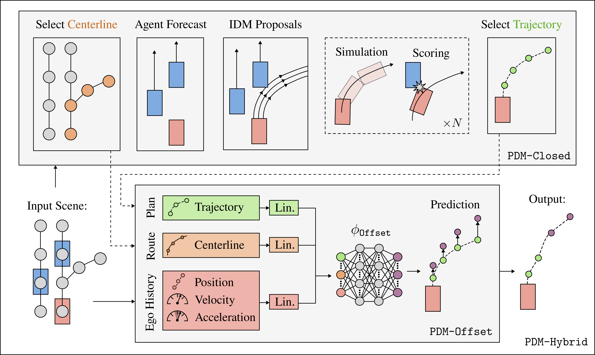

<p align="center">
    
    <h1 align="center">A Framework for Vehicle Motion Planning Research</h1>
    <h3 align="center"><a href="https://arxiv.org/abs/2306.07962">Paper</a> | <a href="https://danieldauner.github.io/assets/pdf/Dauner2023CORL_supplementary.pdf">Supplementary</a> | <a href="https://danieldauner.github.io/assets/pdf/Dauner2023CORL_poster.pdf">Poster</a> | <a href="#videos">Videos</a> </h3>
</p>

<br/>

> [**Parting with Misconceptions about Learning-based Vehicle Motion Planning**](https://arxiv.org/abs/2306.07962)  <br>
> [Daniel Dauner](https://danieldauner.github.io/)<sup>1,2</sup>, [Marcel Hallgarten](https://mh0797.github.io/)<sup>1,3</sup>, [Andreas Geiger](https://www.cvlibs.net/)<sup>1,2</sup>, and [Kashyap Chitta](https://kashyap7x.github.io/)<sup>1,2</sup>  <br>
> <sup>1</sup> University of Tübingen, <sup>2</sup> Tübingen AI Center, <sup>3</sup> Robert Bosch GmbH <br>
> <br>
> Conference on Robot Learning (CoRL), 2023 <br>
> Winner, 2023 nuPlan Challenge
>
This repo is intended to serve as a starting point for vehicle motion planning research on [nuPlan](https://github.com/motional/nuplan-devkit). We provide a publicly accessible configuration for validation, comprehensive set of baselines, and pre-trained planning models.

<br/>

https://github.com/autonomousvision/tuplan_garage/assets/22528226/f91e9ce2-ae3d-4f1e-933e-d48ee5762497

## News
* **`30 Aug, 2023`:**  Our paper was accepted at [CoRL 2023](https://www.corl2023.org/)!
* **`20 Aug, 2023`:**  We renamed our repository to "tuPlan Garage" due to trademark conflicts.
* **`01 Aug, 2023`:**  We released the code for [GC-PGP](https://arxiv.org/abs/2302.07753)!
* **`26 Jun, 2023`:** We released our [supplementary material](https://danieldauner.github.io/assets/pdf/Dauner2023CORL_supplementary.pdf) and the code for PDM-Closed.
* **`14 Jun, 2023`:** We released our paper on [arXiv](https://arxiv.org/abs/2306.07962).
* **`2 Jun, 2023`:** Our approach won the [2023 nuPlan Challenge](https://opendrivelab.com/AD23Challenge.html#nuplan_planning)!

<br/>

## Overview

- The release of nuPlan marks a new era in vehicle motion planning research, offering the first large-scale real-world dataset and evaluation schemes requiring both precise short-term planning and long-horizon ego-forecasting. Existing systems struggle to simultaneously meet both requirements.

- Indeed, we find that these tasks are fundamentally misaligned and should be addressed independently.

- We further assess the current state of closed-loop planning in the field, revealing the limitations of learning-based methods in complex real-world scenarios and the value of simple rule-based priors such as centerline selection through lane graph search algorithms.

- More surprisingly, for the open-loop sub-task, we observe that the best results are achieved when using only this centerline as scene context (i.e., ignoring all information regarding the map and other agents).

- Combining these insights, we propose an extremely simple and efficient planner which outperforms an extensive set of competitors, winning the nuPlan planning challenge 2023.

<br/>

## Videos

Here are four videos for talks and visualizations of our method:

* [**&#128250; Spotlight**](https://youtu.be/cKIofruqbIk) (1min) - Presentation of our CoRL poster.

* [**&#128250; Supplementary Video**](https://youtu.be/iI5iy5QLv6g) (3min) - Comparison of simulation modes and methods in nuPlan.

* [**&#128250; Talk CVPR'23 E2EAD**](https://youtu.be/ZwhXilQKULY?t=1975) (5min) - Competition presentation. ([Slides](https://danieldauner.github.io/assets/pdf/slides/Dauner2023CORL_slides.pdf))

* [**&#128250; Talk CVPR'23 WAD**](https://youtu.be/x_42Fji1Z2M) (18min) - Keynote about Misconceptions in Autonomous Driving. ([Slides](https://www.cvlibs.net/shared/common_misconceptions.pdf))

<br/>

## Contributing
If you consider contributing to tuPlan Garage, make sure to check out our <a href="CONTRIBUTING.md">Contribution Guidelines</a>

## Method

> We decompose the process of determining a safe and comfortable trajectory into two sub-tasks: (1) planning the short-term motion, and (2) accurately forecasting the long-term ego trajectory. While the former primarily impacts closed-loop performance, the latter is essential for the open-loop task. Our method employs a rule-based predictive planner to generate a trajectory proposal, and a learned ego-forecasting module that refines the trajectory with a particular emphasis on long-term forecasting.

<div align="center">

</div>


## Results
Planning results on the proposed *Val14* benchmark. Please refer to the [paper](https://arxiv.org/abs/2306.07962) for more details.

| **Method**        | **Representation**     | **CLS-R ↑** | **CLS-NR ↑** | **OLS ↑**  | **Time (ms) ↓** |
|-------------------|--------------|------------|--------------|------------|------------|
| [Urban Driver](https://arxiv.org/abs/2109.13333)*  | Polygon      | 50         | 53           | 82         | 64         |
| [GC-PGP](https://arxiv.org/abs/2302.07753v1)        | Graph        | 55         | 59           | 83         | 100        |
| [PlanCNN](https://arxiv.org/abs/2210.14222)       | Raster       | 72         | 73           | 64         | 43         |
| [IDM](https://arxiv.org/abs/cond-mat/0002177)           | Centerline   | 77         | 76           | 38         | 27         |
| PDM-Open          | Centerline   | 54         | 50           | **86**     | **7**      |
| PDM-Closed        | Centerline   | **92**     | **93**       | 42         | 91         |
| PDM-Hybrid        | Centerline   | **92**     | **93**       | 84         | 96         |
| *Log Replay*      | *GT*         | *80*       | *94*         | *100*      | -          |

*Open-loop reimplementation of Urban Driver

## To Do
- [ ] Additional baselines
- [ ] Visualization scripts
- [x] Contribution guide
- [x] ML planners code & checkpoints
- [x] Supplementary material, video, slides
- [x] Val14 benchmark
- [x] Installation tutorial
- [x] PDM-Closed release
- [x] Initial repo & main paper


## Getting started

### 1. Installation
To install tuPlan Garage, please follow these steps:
- setup the nuPlan dataset ([described here](https://nuplan-devkit.readthedocs.io/en/latest/dataset_setup.html)) and install the nuPlan devkit ([see here](https://nuplan-devkit.readthedocs.io/en/latest/installation.html))
- download tuPlan Garage and move inside the folder
```
git clone https://github.com/autonomousvision/tuplan_garage.git && cd tuplan_garage
```
- make sure the environment you created when installing the nuplan-devkit is activated
```
conda activate nuplan
```
- install the local tuplan_garage as a pip package
```
pip install -e .
```
- add the following environment variable to your `~/.bashrc`
```
NUPLAN_DEVKIT_ROOT="$HOME/nuplan-devkit/"
```

### 2. Training
When running a training, you have to add the `hydra.searchpath` for the `tuplan_garage` correctly.
Note: since hydra does not yet support appending to lists ([see here](https://github.com/facebookresearch/hydra/issues/1547)), you have to add the original searchpaths in the override.
Training scripts can be run with the scripts found in `/scripts/training/`.
Before training from an already existing cache, please check [this](https://github.com/motional/nuplan-devkit/issues/128) issue.
You can find our trained models [here](https://drive.google.com/drive/folders/1LLdunqyvQQuBuknzmf7KMIJiA2grLYB2?usp=sharing).

### 3. Evaluation
Same as for the training, when running an evaluation, you have to add the `hydra.searchpath` for the `tuplan_garage` correctly.
The example below runs an evaluation of the `pdm_closed_planner` on the `val14_split`, both of which are part of the tuplan_garage
```
python $NUPLAN_DEVKIT_ROOT/nuplan/planning/script/run_simulation.py \
+simulation=closed_loop_nonreactive_agents \
planner=pdm_closed_planner \
scenario_filter=val14_split \
scenario_builder=nuplan \
hydra.searchpath="[pkg://tuplan_garage.planning.script.config.common, pkg://tuplan_garage.planning.script.config.simulation, pkg://nuplan.planning.script.config.common, pkg://nuplan.planning.script.experiments]"
```
You can find exemplary shells scripts in `/scripts/simulation/`

## Contact
If you have any questions or suggestions, please feel free to open an issue or contact us (daniel.dauner@uni-tuebingen.de).


## Citation
If you find tuPlan Garage useful, please consider giving us a star &#127775; and citing our paper with the following BibTeX entry.

```BibTeX
@InProceedings{Dauner2023CORL,
  title={Parting with Misconceptions about Learning-based Vehicle Motion Planning},
  author={Dauner, Daniel and Hallgarten, Marcel and Geiger, Andreas and Chitta, Kashyap},
  booktitle={Conference on Robot Learning (CoRL)},
  year={2023}
}
```


## Disclaimer
tuPlan Garage includes code from Motional's [nuplan-devkit](https://github.com/motional/nuplan-devkit). We are not affiliated with Motional, and the repository is not published, maintained or otherwise related to Motional.


## Other resources <a name="otherresources"></a>

<a href="https://twitter.com/AutoVisionGroup" target="_blank">
    
  </a>
<a href="https://twitter.com/kashyap7x" target="_blank">
    
  </a>
<a href="https://twitter.com/DanielDauner" target="_blank">
    
  </a>
<a href="https://twitter.com/MHallgarten0797" target="_blank">
    
  </a>

- [NAVSIM](https://github.com/autonomousvision/navsim) | [SLEDGE](https://github.com/autonomousvision/sledge) | [CARLA garage](https://github.com/autonomousvision/carla_garage) | [Survey on E2EAD](https://github.com/OpenDriveLab/End-to-end-Autonomous-Driving)
- [PlanT](https://github.com/autonomousvision/plant) | [KING](https://github.com/autonomousvision/king) | [TransFuser](https://github.com/autonomousvision/transfuser) | [NEAT](https://github.com/autonomousvision/neat)

<p align="right">(<a href="#top">back to top</a>)</p>
