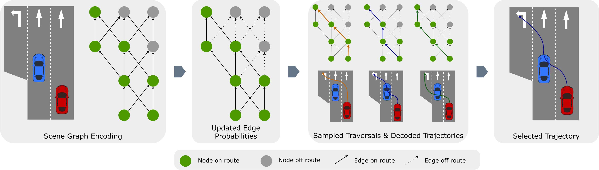

<p align="center">
    <h1 align="center">Goal-Conditionend Prediction with Graph Based Policy (GC-PGP)</h1>
    <h3 align="center"><a href="https://arxiv.org/abs/2302.07753">Paper</a> | Talk | Slides  </h3>
</p>

> [**From Prediction To Planning with Goal Conditioned Lane Graph Traversals**](https://arxiv.org/abs/2302.07753)  <br>
> [Marcel Hallgarten](https://mh0797.github.io//)<sup>1,2</sup>, [Martin Stoll](#)<sup>1</sup>, [Andreas Zell](#)<sup>2</sup><br>
> <sup>1</sup> Robert Bosch GmbH, <sup>2</sup> University of Tübingen
>
> This is the official code for the GC-PGP model.

## Overview
- GC-PGP incorporates intention into a state-of-the-art predictor, namely PGP and converts it into an effective planner
- we introduce a novel method for goal conditioning that precludes plans going off-route from being considered

## News
* **`26 Sept, 2023`:** Our paper will be presented at ITSC 2023. Join us in Session MoP09 in Room 5A!
* **`31 Jul, 2023`:**  We released the code and model checkpoint!
* **`12 Jul, 2023`:**  Our paper was accepted at the 26th IEEE International Conference on Intelligent Transportation Systems ITSC 2023!
* **`15 Feb, 2023`:** We released our paper on [arXiv](https://arxiv.org/abs/2302.07753).

## Method
> We propose a novel goal-conditioning method. Our key insight is that conditioning prediction on a navigation goal at the behaviour level outperforms other widely adopted methods, with the additional benefit of increased model interpretability. Moreover, our Method can be applied at inference time only. Hence, no ground-truth navigation command is required during training.
<div align="center">

</div>

## Results
Please find planning results on the *Val14* benchmark in the [README](../../../../../../README.md). Please refer to the [paper](https://arxiv.org/abs/2302.07753) for more evaluations.

## Parameters
* **`smooth_output_trajectory`**: if set to `True` the output trajectory is interpolated and smoothed before passing it to the controller.
* **`use_raster_feature_builder`**: if set to `True` the model builds and returns a raster feature which is then used to generate additional visualizations during training, which are displayed in the tensorboard.
* **`use_route_feature`**: if set to `True` the encoder uses the route information as an additional node feature. See the `node_feature` baseline in our paper for details.
* **`interpolate_yaw`**: by default, the output trajectories only consist of 2D waypoints. However, nuPlan expects SE2 poses that also comprise the yaw angle. If set to `True` the yaw angle for the output trajectory is estimated by interpolation of the waypoints. Can be set to `False` for training, to reduce computational burden.
* **`use_route_mask`**: if set to `True`, the aggregator uses either a hard mask or a soft mask. For GC-PGP this is set to `False` in training and to `True` in inference.
* **`hard_masking`**: if set to `True`, the aggregator uses a hard mask. If false, a soft mask is used. **Note**: this parameter has no effect if `use_route_mask` is set to `False`.
* **`average_output_trajectories`**: if set to `True`, the output trajectory is obtained by averaging of all unclustered trajectories instead of selecting the one with highest predicted likelihood one.
* **`filter_trajectories_by_endpoint`**: if set to `True`, the predicted trajectories are filtered by their distance to the route before selecting the one with the highest predicted likelihood. See the `filter on route` baseline in our paper for details. **Note**: this parameter has no effect if `average_output_trajectories` is set to `True`.

## Citation
If you find this method useful, please consider citing our paper with the following BibTeX entry.

```BibTeX
@article{hallgarten2023prediction,
  title={From Prediction to Planning With Goal Conditioned Lane Graph Traversals},
  author={Hallgarten, Marcel and Stoll, Martin and Zell, Andreas},
  journal={arXiv},
  volume={2302.07753},
  year={2023}
}
```

## Acknowledgements
the GC-PGP Code is based on code from the following projects: [pgp](https://github.com/nachiket92/PGP). Thanks to the community for these great open-source contributions!
